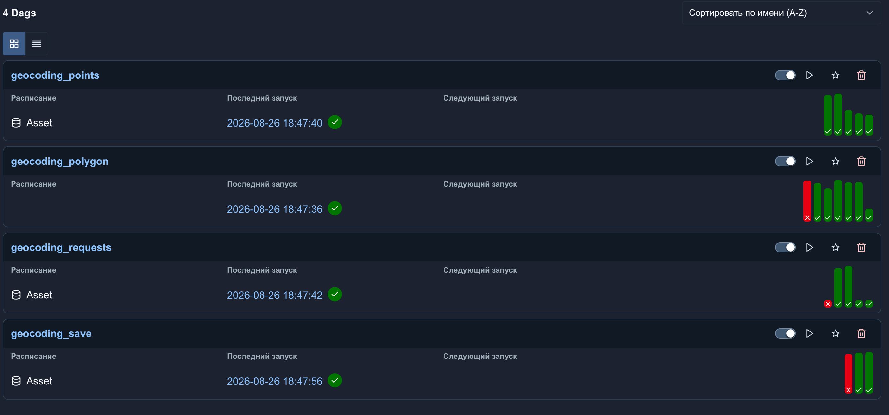
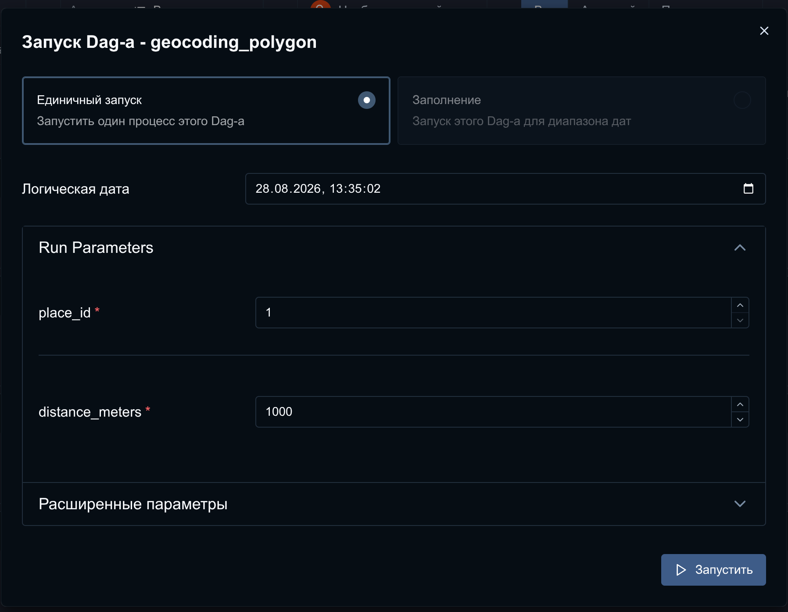
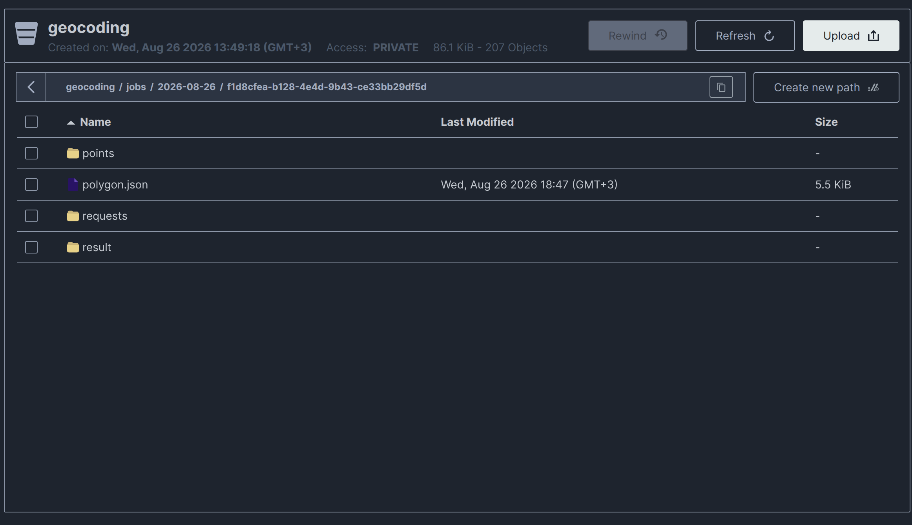
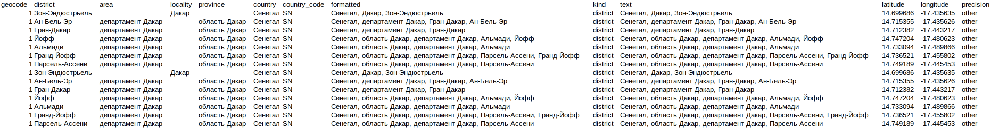

# 🗺️ Yandex API Region Parser

> An ETL service that enriches locality data with district information using the **Yandex Geocoder API**, orchestrated with **Apache Airflow**.

[](https://www.python.org/)
[](https://airflow.apache.org/)
[](https://www.postgresql.org/)
[](https://docs.pydantic.dev/)
[](https://github.com/features/actions)
[]()

---

## 💡 About the project

The service takes a locality (city, region) from the database, builds its polygon, splits the area into a grid of points, and for each point queries the **Yandex Geocoder API** for district information. The result is an enriched dataset of districts, saved to CSV.

The idea came from a practical need: the Yandex Geocoder has no way to return *all* the districts within a city in a single request — you have to geocode many points across the area and aggregate the unique districts. This project automates that process and wraps it in a fault-tolerant pipeline.

**Why this is interesting from an engineering standpoint:**
- A full ETL cycle: geometry → external API → transformation → storage
- Orchestration via Airflow, with data passed between DAGs through **Assets** (event-driven, not just cron scheduling)
- A clean, layered architecture with abstractions that let you swap the data source or geocoder without touching business logic
- Test coverage: unit and integration tests (a real Postgres instance in Docker via `testcontainers`, a mocked HTTP server)
- CI/CD with GitHub Actions

---

## ⚙️ How it works

The pipeline consists of 4 connected Airflow DAGs that trigger one another through Asset events:

```
geocoding_polygon  →  geocoding_points  →  geocoding_requests  →  geocoding_save
   (build the           (split it into        (geocode each          (save the
    place's               a grid of              point via              final CSV
    polygon)              points)                Yandex API,            to MinIO / S3)
                                                  in parallel)
```

1. **geocoding_polygon** — fetches the place's polygon from PostgreSQL and uploads it as GeoJSON to MinIO (an S3-compatible store)
2. **geocoding_points** — splits the polygon into a regular grid of points with a given spacing (in meters, using a metric projection via `pyproj`)
3. **geocoding_requests** — geocodes each point in parallel (`task.expand`) via the Yandex API, with retries and a dedicated pool
4. **geocoding_save** — aggregates the results, deduplicates by district name, and saves the final CSV

### The pipeline in action

All 4 DAGs are chained via Assets and run automatically one after another:



The polygon and point-grid generation can also be triggered manually, by specifying a place ID and grid spacing in meters:



## 🏗️ Architecture

The project follows Clean Architecture principles — business logic doesn't depend on concrete implementations (PostgreSQL, the Yandex API, CSV):

```
backend/
├── api/           # Yandex Geocoder — client, models, service (behind the GeocoderClient interface)
├── database/       # PostgreSQL — repository, service (behind the PlaceRepository interface)
├── geometry/       # Generating points inside a polygon (shapely + pyproj)
├── transformer/     # Mapping API responses to business models, deduplication
├── etl/            # Orchestration of the whole pipeline
└── writer/         # Writing out the result (CSV)
```

Any component (the geocoder, the database, the output format) can be swapped without touching the rest of the code — thanks to abstract interfaces (`GeocoderClient`, `PlaceRepository`).

Intermediate data (the polygon, the point grid, geocoder responses) is stored in MinIO within a single job — this lets large volumes of data pass between DAGs without bloating XCom, and lets individual pipeline steps be retried after a failure:



## 🧰 Tech stack

| Area | Technologies |
|---|---|
| Language | Python 3.14 |
| Orchestration | Apache Airflow 3.3 (Assets, dynamic task mapping) |
| Database | PostgreSQL 16, psycopg3 (connection pooling) |
| Storage | MinIO (S3-compatible) |
| Geometry | Shapely, PyProj |
| Data validation | Pydantic v2, pydantic-settings |
| Testing | pytest, testcontainers, pytest-httpserver |
| Infrastructure | Docker Compose, GitHub Actions CI |

## ✅ Testing

The project is covered by tests at every level:

- **Unit** — isolated tests of business logic with mocked dependencies
- **Integration** — a real PostgreSQL instance in a Docker container (`testcontainers`), a mocked Yandex API (`pytest-httpserver`)
- **Airflow tests** — separately verify the structure of the DAGs (tasks, inlets/outlets)

```bash
pytest tests/unit tests/integration
docker compose --profile tests run --rm airflow-tests
```

CI runs both test suites on every PR to `develop`/`main`.

## 🚀 Getting started

```bash
cp .env.example .env   # fill in your Yandex Geocoder API key and database settings
docker compose up
```

The Airflow UI will be available at `http://localhost:8080`, and MinIO at `http://localhost:9001`.

After the first run, you need to create an Airflow Pool to limit the number of concurrent requests to the Yandex Geocoder API (the API has an RPS limit, and the `process_point` task in the `geocoding_requests` DAG is fanned out in parallel across every point in the grid):

`Admin → Pools → Add pool` → name it `yandex_geocoder`, with `1` slot (or more, depending on your API key's limits). Without this step, the geocoding tasks will sit stuck in the queue.

### Configuring for your own DB schema

The SQL queries used to fetch place data live in separate files rather than being hardcoded. See `sql/example/t_place.sql` for an example. To point the project at your own DB schema, just edit the SQL query in that folder (the path is configurable via `DB_SQL_FILES_PATH` in `.env`) — no service code needs to change.

### Secrets and local overrides

The `ENV_PATH` field in `.env` lets you point to an additional `.env` file containing secrets (for example, real database credentials), which is kept out of the repository and loaded separately from `.env.example`.

## 📊 Sample output

A snippet of the final CSV — district, area, country, and coordinates for each geocoded point:



## 📌 Status

The project is under active development. Upcoming plans include improving the Airflow pipeline and the overall architecture.

## 👤 Author

*Your name* — [GitHub](https://github.com/DanilFaritovich) · [LinkedIn](https://www.linkedin.com/in/danil-miftakhov-55468b399/)
